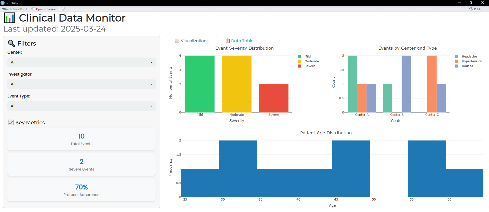

# 📊 Clinical Data Monitor

A responsive, interactive dashboard for real-time monitoring of clinical trial safety and operational metrics — built with **R**, **Shiny**, and **Plotly**. Designed for clinical teams, data managers, and pharmacovigilance professionals to quickly identify trends, assess protocol adherence, and prioritize high-risk events.

> ✨ **Fully in English** — ready for international clinical research environments.

---

## 🎯 Features

- 🔍 **Dynamic filtering** by center, investigator, and event type  
- 📈 **Key performance indicators (KPIs)**:
  - Total number of adverse events
  - Count of *Severe* events
  - Protocol adherence rate (`YES`/`NO`)
- 📊 **Interactive visualizations**:
  - Event severity distribution (Mild/Moderate/Severe)
  - Events by center and event type
  - Patient age distribution (histogram)
- 📋 **Export-ready data table** with pagination and horizontal scroll
- 🗓️ **Auto-updating "Last updated"** timestamp from `date_reported`
- 🎨 Clean, modern UI with Bootstrap 5 (`flatly` theme) and Google Fonts

---

## 🖼️ Preview

  
*Example: Monitoring adverse events across trial centers*

---

## 🛠️ Technologies

| Tool | Purpose |
|------|---------|
| **R** | Statistical computing & data processing |
| **Shiny** | Interactive web application framework |
| **Plotly** | Interactive, publication-ready graphs |
| **DT** | Interactive HTML tables |
| **tidyverse** (`dplyr`, `lubridate`, `janitor`) | Data cleaning & transformation |
| **bslib** + **shinyWidgets** | Modern UI/UX enhancements |

---

## 📁 Project Structure
